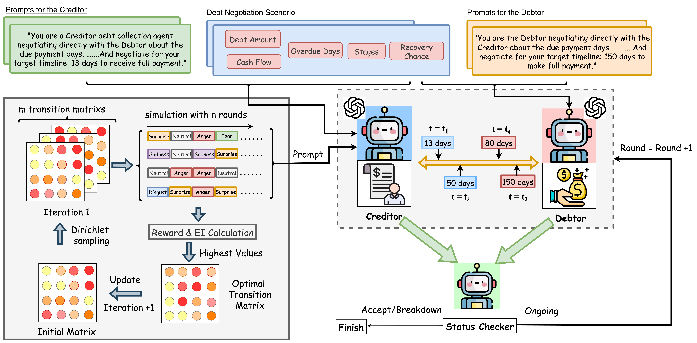

# EmoDebt: Bayesian-Optimized Emotional Intelligence for Strategic Agent-to-Agent Debt Recovery




## Key Features

- 🧠 **Bayesian Emotional Optimization**: Uses Gaussian Processes to learn Markovian transition matrices between 7 emotional states
- 🎭 **Dynamic Emotional Adaptation**: Creditor agent adjusts strategy based on debtor's emotional profile (happy, angry, sad, etc.)
- ⚖️ **Strategic Concession Patterns**: Implements psychologically-grounded negotiation tactics with temporal constraints
- 📊 **Online Learning**: Continuously improves emotional strategies through negotiation outcomes
- 🤖 **Multi-Model Support**: Compatible with GPT-4o-mini, GPT-5-mini, and other LLMs via LangGraph

## Installation
pip install requirements.txt

## Create a config file named `.env` which contains the following lines:
   ```sh
   OPENAI_API_KEY=...
   ```

## 📁 Dataset Parameters

| Parameter | Description | Default |
|-----------|-------------|---------|
| `--debt_csv` | Input CSV file path | `./data/credit_recovery_scenarios.csv` |
| `--n_trial_per_debt` | Negotiation trials per scenario | `2` |
| `--n_emotions` | Emotions per agent profile | `3` |
| `--out_fn` | Output JSON file | `data/debt_collection_scenarios.json` |

### Example Dataset Configuration

python langgraph_bargain_debt_simple.py \
--debt_csv ./data/my_debt_cases.csv \
--n_trial_per_debt 5 \
--n_emotions 5 \
--out_fn ./results/custom_scenarios.json

## Debt recovery negotitaion 
python langgraph_bargain_debt.py --mode bayesian --model_creditor gpt-4o-mini --model_debtor gpt-5-mini --debtor_emotion vanilla --iterations 5 --scenarios 20


### Key Parameters

| Parameter | Description | Options |
|-----------|-------------|---------|
| `--mode` | Learning strategy | `bayesian`, `vanilla` |
| `--model_creditor` | LLM for creditor agent | `gpt-4o-mini`, `gpt-5-mini`, etc. |
| `--model_debtor` | LLM for debtor agent | `gpt-4o-mini`, `gpt-5-mini`, etc. |
| `--debtor_emotion` | Fixed emotional profile | `vanilla`,`happy`, `angry`, `sad`, `all` etc. |
| `--iterations` | Learning cycles per scenario | 1-20 |
| `--scenarios` | Number of debt cases | 1-100 |

## 📈 Evaluation Metrics

### Success Rate
- **Formula**: `(Successful Negotiations) / (Total Negotiations) × 100%`
- **Description**: Percentage of negotiations that reach mutual agreement

### Collection Efficiency
- **Formula**: `Target Days / Actual Collection Days`
- **Description**: Ratio of ideal vs. actual payment timeline

### Recovery Rate
- **Formula**: `1 - (∣Actual Days - Target Days∣ / Target Days)`
- **Description**: Measures adherence to target timeline (0-1 scale)

### Negotiation Speed
- **Metric**: Average number of conversation rounds to reach agreement
- **Description**: Efficiency of the negotiation process

### Emotional Convergence
- **Metric**: Stability and optimality of emotional transition patterns
- **Description**: Measures how well the Bayesian optimizer learns effective emotional sequences

### Comprehensive Evaluation Example

## 📊 Citation

If you use EmoDebt in your research, please cite:

@article{emodebt2024,
title={EmoDebt: Bayesian-Optimized Emotional Intelligence for Strategic Agent-to-Agent Debt Recovery},
author={Yunbo Long},
journal={arXiv preprint},
year={2024},
url={https://github.com/your-username/emodebt}
}


## 📄 License

This project is licensed under the **MIT License** - see the [LICENSE](LICENSE) file for details.

