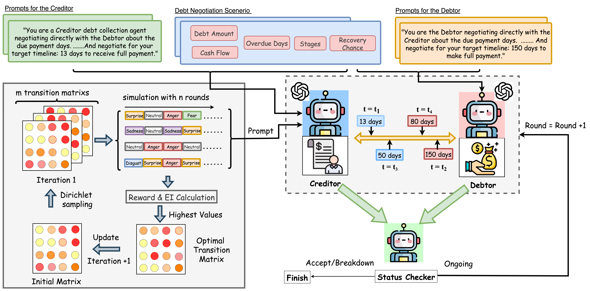

# EmoDebt: Bayesian-Optimized Emotional Intelligence for Strategic Agent-to-Agent Debt Recovery

[](https://www.python.org/downloads/)
[](https://opensource.org/licenses/MIT)
[](https://arxiv.org/abs/2503.21080)
[](https://aamas2026.org/)



**EmoDebt** is an advanced AI system that leverages Bayesian optimization and emotional intelligence for automated debt collection negotiations. The system uses sophisticated machine learning techniques to optimize creditor-debtor interactions, improving recovery rates while maintaining professional and ethical standards.

> **Published at AAMAS 2026** — 25th International Conference on Autonomous Agents and Multiagent Systems, May 25-29, 2026, Paphos, Cyprus.

## 🌟 Key Features

- 🧠 **Bayesian Emotional Optimization**: Uses Gaussian Processes to learn optimal Markovian transition matrices between 7 emotional states (happy, angry, sad, fear, disgust, surprise, neutral)
- 🎭 **Dynamic Emotional Adaptation**: Creditor agents dynamically adjust negotiation strategies based on debtor's emotional profile and responses
- ⚖️ **Strategic Concession Patterns**: Implements psychologically-grounded negotiation tactics with temporal payment constraints
- 📊 **Online Learning**: Continuously improves emotional strategies through reinforcement learning from negotiation outcomes
- 🤖 **Multi-Model Support**: Compatible with GPT-4o-mini, GPT-5-mini, Claude, and other state-of-the-art LLMs via LangGraph
- 🔄 **Real-time Adaptation**: Adjusts emotional strategies mid-negotiation based on debtor responses
- 📈 **Performance Analytics**: Comprehensive metrics including success rates, collection efficiency, and emotional convergence

## 📊 Key Results

| Metric | Improvement |
|--------|-------------|
| **Success Rate** | +46.2% average across all model pairings (up to 99.7%) |
| **Collection Efficiency** | -86.5% reduction in collection timelines |
| **Negotiation Speed** | -67.5% reduction in dialogue turns |

## 🚀 Quick Start

### Prerequisites

- Python 3.8 or higher
- OpenAI API key (or other supported LLM provider)
- Git

### Installation

1. **Clone the repository**:
   ```bash
   git clone https://github.com/Yunbo-max/EmoDebt.git
   cd EmoDebt
   ```

2. **Install dependencies**:
   ```bash
   pip install -r requirements.txt
   ```

3. **Set up environment variables**:
   Create a `.env` file in the project root:
   ```bash
   # Required API keys
   OPENAI_API_KEY=your_openai_api_key_here

   # Optional: Other LLM providers
   ANTHROPIC_API_KEY=your_anthropic_key_here
   ```

4. **Verify installation**:
   ```bash
   python langgraph_bargain_debt.py --mode test --scenarios 1
   ```

## 📚 Usage Guide

### 1. Prepare Your Dataset

First, generate negotiation scenarios from your debt collection data:

```bash
python debt_prepare.py \
    --debt_csv ./data/credit_recovery_scenarios.csv \
    --n_trial_per_debt 3 \
    --n_emotions 4 \
    --out_fn ./data/debt_scenarios.json
```

**Dataset Parameters:**

| Parameter | Description | Default | Range |
|-----------|-------------|---------|-------|
| `--debt_csv` | Input CSV file path | `./data/credit_recovery_scenarios.csv` | Any valid CSV path |
| `--n_trial_per_debt` | Negotiation trials per scenario | `2` | 1-10 |
| `--n_emotions` | Emotions per agent profile | `3` | 1-7 |
| `--out_fn` | Output JSON file | `data/debt_collection_scenarios.json` | Any valid JSON path |

### 2. Run Bayesian-Optimized Negotiations

Execute advanced debt recovery negotiations with emotional learning:

```bash
python langgraph_bargain_debt.py \
    --mode bayesian \
    --model_creditor gpt-4o-mini \
    --model_debtor gpt-4o-mini \
    --debtor_emotion all \
    --iterations 10 \
    --scenarios 50 \
    --max_dialog 25
```

**Core Parameters:**

| Parameter | Description | Options | Default |
|-----------|-------------|---------|---------|
| `--mode` | Learning strategy | `bayesian`, `vanilla`, `legacy`, `test` | `bayesian` |
| `--model_creditor` | LLM for creditor agent | `gpt-4o-mini`, `gpt-5-mini`, `claude-3-sonnet` | `gpt-4o-mini` |
| `--model_debtor` | LLM for debtor agent | `gpt-4o-mini`, `gpt-5-mini`, `claude-3-sonnet` | `gpt-4o-mini` |
| `--debtor_emotion` | Debtor emotional profile | `vanilla`, `happy`, `angry`, `sad`, `fear`, `disgust`, `surprise`, `neutral`, `all` | `all` |
| `--iterations` | Bayesian learning cycles | 1-50 | `3` |
| `--scenarios` | Number of debt cases | 1-1000 | `2` |
| `--max_dialog` | Max conversation rounds | 5-100 | `30` |
| `--out_dir` | Results output directory | Any valid path | `results_bayesian_debt` |

### 3. Example Workflows

#### Basic Testing
```bash
# Quick test with minimal scenarios
python langgraph_bargain_debt.py --mode test --scenarios 2

# Test specific debtor emotion
python langgraph_bargain_debt.py --mode bayesian --debtor_emotion angry --scenarios 5
```

#### Production-Scale Evaluation
```bash
# Comprehensive evaluation across all emotions
python langgraph_bargain_debt.py \
    --mode bayesian \
    --debtor_emotion all \
    --iterations 15 \
    --scenarios 100 \
    --model_creditor gpt-4o-mini \
    --model_debtor gpt-4o-mini
```

#### Comparative Analysis
```bash
# Compare Bayesian vs Vanilla approaches
python langgraph_bargain_debt.py --mode bayesian --scenarios 50 --out_dir results_bayesian
python langgraph_bargain_debt.py --mode vanilla --scenarios 50 --out_dir results_vanilla
```

## 📊 Performance Metrics

### Success Rate
- **Formula**: `(Successful Negotiations) / (Total Negotiations) × 100%`
- **Description**: Percentage of negotiations that reach mutual payment agreement

### Collection Efficiency
- **Formula**: `Target Days / Actual Collection Days`
- **Description**: Ratio of ideal vs. actual payment timeline

### Recovery Rate
- **Formula**: `1 - (|Actual Days - Target Days| / Target Days)`
- **Description**: Measures adherence to target timeline (0-1 scale)

### Negotiation Speed
- **Metric**: Average number of conversation rounds to reach agreement
- **Description**: Efficiency of the negotiation process

### Emotional Convergence
- **Metric**: Stability and optimality of emotional transition patterns
- **Description**: Measures how well the Bayesian optimizer learns effective emotional sequences

### Bayesian Learning Progress
- **Metric**: Expected Improvement (EI) over iterations
- **Description**: Tracks the learning progress of the Bayesian optimization

## 🏗️ System Architecture

### Emotional States

The system models 7 distinct emotional states based on Ekman's basic emotions:

| Emotion | Description | Strategic Use |
|---------|-------------|---------------|
| **Happy** | Optimistic, positive tone | Building rapport, encouraging cooperation |
| **Angry** | Firm, assertive approach | Emphasizing urgency, creating pressure |
| **Sad** | Empathetic, understanding | Acknowledging debtor difficulties |
| **Fear** | Cautious, concerned tone | Highlighting consequences |
| **Disgust** | Disappointed, professional | Expressing concern about situation |
| **Surprise** | Engaging, unexpected | Introducing creative solutions |
| **Neutral** | Balanced, fact-focused | Professional baseline approach |

### Psychological Priors (Transition Matrix P⁰)

Initialized from Thornton & Tamir (2017) and Sun et al. (2023):

| From \ To | Happy | Surprise | Angry | Sad | Disgust | Fear | Neutral |
|-----------|-------|----------|-------|-----|---------|------|---------|
| **Happy** | 0.30 | 0.15 | 0.05 | 0.10 | 0.05 | 0.05 | 0.30 |
| **Surprise** | 0.20 | 0.20 | 0.15 | 0.10 | 0.10 | 0.10 | 0.15 |
| **Angry** | 0.10 | 0.10 | 0.25 | 0.15 | 0.15 | 0.10 | 0.15 |
| **Sad** | 0.15 | 0.10 | 0.10 | 0.20 | 0.10 | 0.15 | 0.20 |
| **Disgust** | 0.10 | 0.15 | 0.20 | 0.15 | 0.15 | 0.10 | 0.15 |
| **Fear** | 0.15 | 0.10 | 0.10 | 0.20 | 0.10 | 0.15 | 0.20 |
| **Neutral** | 0.15 | 0.15 | 0.15 | 0.15 | 0.10 | 0.10 | 0.20 |

## 🔧 Advanced Configuration

### Custom Emotional Profiles

Create custom emotional transition matrices:

```python
from langgraph_bargain_debt import BayesianEmotionOptimizer

# Initialize with specific debtor emotion
optimizer = BayesianEmotionOptimizer(debtor_emotion="angry")

# Get current emotional configuration
config = optimizer.get_current_emotion_config(round_num=1)
print(f"Current emotion: {config['emotion']}")
print(f"Strategy: {config['emotion_text']}")
```

### Multi-Model Experiments

Test different LLM combinations:

```bash
# GPT-4o-mini creditor vs GPT-5-mini debtor
python langgraph_bargain_debt.py --model_creditor gpt-4o-mini --model_debtor gpt-5-mini

# Claude creditor vs GPT debtor (requires Anthropic API key)
python langgraph_bargain_debt.py --model_creditor claude-3-sonnet --model_debtor gpt-4o-mini
```

### Custom Scenarios

Format your debt data following this CSV structure:

```csv
Creditor Name,Debtor Name,Credit Type,Original Amount (USD),Outstanding Balance (USD),Days Overdue,Creditor Target Days,Debtor Target Days,Purchase Purpose,Reason for Overdue,Business Sector,Collateral,Recovery Stage,Cash Flow Situation,Business Impact Description,Proposed Solution,Recovery Probability (%),Interest Accrued (USD)
```

## 📚 Citation

If you use EmoDebt in your research, please cite:

```bibtex
@inproceedings{long2026emodebt,
    title={EmoDebt: Bayesian-Optimized Emotional Intelligence for Strategic Agent-to-Agent Debt Recovery},
    author={Long, Yunbo and Liu, Yuhan and Xu, Liming and Brintrup, Alexandra},
    booktitle={Proceedings of the 25th International Conference on Autonomous Agents and Multiagent Systems (AAMAS)},
    year={2026},
    address={Paphos, Cyprus},
    url={https://arxiv.org/abs/2503.21080}
}
```

## 📄 License

This project is licensed under the **MIT License** - see the [LICENSE](LICENSE) file for details.

---

<div align="center">

**Built with ❤️ by [Yunbo Long](https://github.com/Yunbo-max)**

[⭐ Star this repo](https://github.com/Yunbo-max/EmoDebt) | [🐛 Report Bug](https://github.com/Yunbo-max/EmoDebt/issues) | [💡 Request Feature](https://github.com/Yunbo-max/EmoDebt/issues)

</div>
