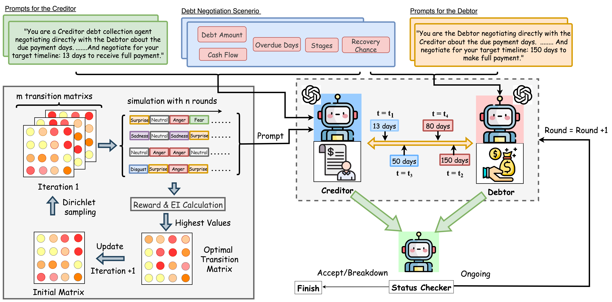

# EmoDebt: Bayesian-Optimized Emotional Intelligence for Strategic Agent-to-Agent Debt Recovery

[](https://www.python.org/downloads/)
[](https://opensource.org/licenses/MIT)
[](https://arxiv.org/abs/XXXX.XXXXX)



**EmoDebt** is an advanced AI system that leverages Bayesian optimization and emotional intelligence for automated debt collection negotiations. The system uses sophisticated machine learning techniques to optimize creditor-debtor interactions, improving recovery rates while maintaining professional and ethical standards.

## 🌟 Key Features

- 🧠 **Bayesian Emotional Optimization**: Uses Gaussian Processes to learn optimal Markovian transition matrices between 7 emotional states (happy, angry, sad, fear, disgust, surprise, neutral)
- 🎭 **Dynamic Emotional Adaptation**: Creditor agents dynamically adjust negotiation strategies based on debtor's emotional profile and responses
- ⚖️ **Strategic Concession Patterns**: Implements psychologically-grounded negotiation tactics with temporal payment constraints
- 📊 **Online Learning**: Continuously improves emotional strategies through reinforcement learning from negotiation outcomes
- 🤖 **Multi-Model Support**: Compatible with GPT-4o-mini, GPT-4o, Claude, and other state-of-the-art LLMs via LangGraph
- 🔄 **Real-time Adaptation**: Adjusts emotional strategies mid-negotiation based on debtor responses
- 📈 **Performance Analytics**: Comprehensive metrics including success rates, collection efficiency, and emotional convergence

## 🚀 Quick Start

### Prerequisites

- Python 3.8 or higher
- OpenAI API key (or other supported LLM provider)
- Git

### Installation

1. **Clone the repository**:
   ```bash
   git clone https://github.com/Yunbo-max/EmoDebt.git
   cd EmoDebt
   ```

2. **Install dependencies**:
   ```bash
   pip install -r requirements_bayesian.txt
   ```

3. **Set up environment variables**:
   Create a `.env` file in the project root:
   ```bash
   # Required API keys
   OPENAI_API_KEY=your_openai_api_key_here
   
   # Optional: Other LLM providers
   ANTHROPIC_API_KEY=your_anthropic_key_here
   ```

4. **Verify installation**:
   ```bash
   python langgraph_bargain_debt.py --mode test --scenarios 1
   ```

## 📚 Usage Guide

### 1. Prepare Your Dataset

First, generate negotiation scenarios from your debt collection data:

```bash
python debt_prepare.py \
    --debt_csv ./data/credit_recovery_scenarios.csv \
    --n_trial_per_debt 3 \
    --n_emotions 4 \
    --out_fn ./data/debt_scenarios.json
```

**Dataset Parameters:**

| Parameter | Description | Default | Range |
|-----------|-------------|---------|-------|
| `--debt_csv` | Input CSV file path | `./data/credit_recovery_scenarios.csv` | Any valid CSV path |
| `--n_trial_per_debt` | Negotiation trials per scenario | `2` | 1-10 |
| `--n_emotions` | Emotions per agent profile | `3` | 1-7 |
| `--out_fn` | Output JSON file | `data/debt_collection_scenarios.json` | Any valid JSON path |

### 2. Run Bayesian-Optimized Negotiations

Execute advanced debt recovery negotiations with emotional learning:

```bash
python langgraph_bargain_debt.py \
    --mode bayesian \
    --model_creditor gpt-4o-mini \
    --model_debtor gpt-4o-mini \
    --debtor_emotion all \
    --iterations 10 \
    --scenarios 50 \
    --max_dialog 25
```

**Core Parameters:**

| Parameter | Description | Options | Default |
|-----------|-------------|---------|---------|
| `--mode` | Learning strategy | `bayesian`, `vanilla`, `legacy`, `test` | `bayesian` |
| `--model_creditor` | LLM for creditor agent | `gpt-4o-mini`, `gpt-4o`, `claude-3-sonnet` | `gpt-4o-mini` |
| `--model_debtor` | LLM for debtor agent | `gpt-4o-mini`, `gpt-4o`, `claude-3-sonnet` | `gpt-4o-mini` |
| `--debtor_emotion` | Debtor emotional profile | `vanilla`, `happy`, `angry`, `sad`, `fear`, `disgust`, `surprise`, `neutral`, `all` | `all` |
| `--iterations` | Bayesian learning cycles | 1-50 | `3` |
| `--scenarios` | Number of debt cases | 1-1000 | `2` |
| `--max_dialog` | Max conversation rounds | 5-100 | `30` |
| `--out_dir` | Results output directory | Any valid path | `results_bayesian_debt` |

### 3. Example Workflows

#### Basic Testing
```bash
# Quick test with minimal scenarios
python langgraph_bargain_debt.py --mode test --scenarios 2

# Test specific debtor emotion
python langgraph_bargain_debt.py --mode bayesian --debtor_emotion angry --scenarios 5
```

#### Production-Scale Evaluation
```bash
# Comprehensive evaluation across all emotions
python langgraph_bargain_debt.py \
    --mode bayesian \
    --debtor_emotion all \
    --iterations 15 \
    --scenarios 100 \
    --model_creditor gpt-4o \
    --model_debtor gpt-4o-mini
```

#### Comparative Analysis
```bash
# Compare Bayesian vs Vanilla approaches
python langgraph_bargain_debt.py --mode bayesian --scenarios 50 --out_dir results_bayesian
python langgraph_bargain_debt.py --mode vanilla --scenarios 50 --out_dir results_vanilla
```

## 📊 Performance Metrics

### Success Rate
- **Formula**: `(Successful Negotiations) / (Total Negotiations) × 100%`
- **Description**: Percentage of negotiations that reach mutual payment agreement
- **Target**: >75% for optimal performance

### Collection Efficiency
- **Formula**: `Target Days / Actual Collection Days`
- **Description**: Ratio of ideal vs. actual payment timeline
- **Target**: >0.85 indicates efficient collection

### Recovery Rate
- **Formula**: `1 - (|Actual Days - Target Days| / Target Days)`
- **Description**: Measures adherence to target timeline (0-1 scale)
- **Target**: >0.80 for successful timeline management

### Negotiation Speed
- **Metric**: Average number of conversation rounds to reach agreement
- **Description**: Efficiency of the negotiation process
- **Target**: <15 rounds for optimal efficiency

### Emotional Convergence
- **Metric**: Stability and optimality of emotional transition patterns
- **Description**: Measures how well the Bayesian optimizer learns effective emotional sequences
- **Target**: Convergence within 10-15 iterations

### Bayesian Learning Progress
- **Metric**: Expected Improvement (EI) over iterations
- **Description**: Tracks the learning progress of the Bayesian optimization
- **Target**: Positive EI trend with eventual convergence

## 🏗️ System Architecture

### Core Components

1. **BayesianEmotionOptimizer**: Learns optimal emotional transition matrices using Gaussian Processes
2. **AdaptiveDebtBargain**: Main negotiation engine with LangGraph state management
3. **SimplifiedNegotiationSystem**: State detection and timeline extraction
4. **CreditorEmotionLearner**: Legacy learning system for comparison

### Emotional States

The system models 7 distinct emotional states based on Ekman's basic emotions:

| Emotion | Description | Strategic Use |
|---------|-------------|---------------|
| **Happy** | Optimistic, positive tone | Building rapport, encouraging cooperation |
| **Angry** | Firm, assertive approach | Emphasizing urgency, creating pressure |
| **Sad** | Empathetic, understanding | Acknowledging debtor difficulties |
| **Fear** | Cautious, concerned tone | Highlighting consequences |
| **Disgust** | Disappointed, professional | Expressing concern about situation |
| **Surprise** | Engaging, unexpected | Introducing creative solutions |
| **Neutral** | Balanced, fact-focused | Professional baseline approach |

## 📁 Project Structure

```
EmoDebt/
├── langgraph_bargain_debt.py      # Main negotiation system
├── debt_prepare.py                # Dataset preparation utilities
├── requirements_bayesian.txt      # Python dependencies
├── Framework.png                  # System architecture diagram
├── data/
│   ├── credit_recovery_scenarios.csv      # Input debt scenarios
│   ├── debt_collection_scenarios.json     # Processed scenarios
│   └── llm_credit_recovery_v2.csv        # Alternative dataset
├── results_bayesian_debt/         # Output directory for results
└── README.md                      # This file
```

## 🔧 Advanced Configuration

### Custom Emotional Profiles

Create custom emotional transition matrices:

```python
from langgraph_bargain_debt import BayesianEmotionOptimizer

# Initialize with specific debtor emotion
optimizer = BayesianEmotionOptimizer(debtor_emotion="angry")

# Get current emotional configuration
config = optimizer.get_current_emotion_config(round_num=1)
print(f"Current emotion: {config['emotion']}")
print(f"Strategy: {config['emotion_text']}")
```

### Multi-Model Experiments

Test different LLM combinations:

```bash
# GPT-4o creditor vs GPT-4o-mini debtor
python langgraph_bargain_debt.py --model_creditor gpt-4o --model_debtor gpt-4o-mini

# Claude creditor vs GPT debtor (requires Anthropic API key)
python langgraph_bargain_debt.py --model_creditor claude-3-sonnet --model_debtor gpt-4o-mini
```

### Custom Scenarios

Format your debt data following this CSV structure:

```csv
Creditor Name,Debtor Name,Credit Type,Original Amount (USD),Outstanding Balance (USD),Days Overdue,Creditor Target Days,Debtor Target Days,Purchase Purpose,Reason for Overdue,Business Sector,Collateral,Recovery Stage,Cash Flow Situation,Business Impact Description,Proposed Solution,Recovery Probability (%),Interest Accrued (USD)
```

## 🤝 Contributing

We welcome contributions! Please follow these steps:

1. **Fork the repository**
2. **Create a feature branch**: `git checkout -b feature/your-feature-name`
3. **Make your changes** and add tests
4. **Run the test suite**: `python langgraph_bargain_debt.py --mode test`
5. **Commit your changes**: `git commit -m "Add your feature description"`
6. **Push to your branch**: `git push origin feature/your-feature-name`
7. **Create a Pull Request**

### Development Setup

```bash
# Install development dependencies
pip install -r requirements_bayesian.txt

# Run tests
python -m pytest tests/ -v

# Check code formatting
black langgraph_bargain_debt.py debt_prepare.py
```

## 📋 Troubleshooting

### Common Issues

**Issue**: `ImportError: No module named 'langgraph'`
```bash
# Solution: Install LangGraph
pip install langgraph langchain-openai langchain-anthropic
```

**Issue**: `OpenAI API key not found`
```bash
# Solution: Check your .env file
echo $OPENAI_API_KEY  # Should show your key
```

**Issue**: `FileNotFoundError: debt_collection_scenarios.json`
```bash
# Solution: Generate scenarios first
python debt_prepare.py --debt_csv ./data/credit_recovery_scenarios.csv
```

**Issue**: Poor negotiation performance
```bash
# Solution: Increase learning iterations
python langgraph_bargain_debt.py --mode bayesian --iterations 20 --scenarios 10
```

### Performance Optimization

- **Memory Usage**: For large-scale experiments (>1000 scenarios), consider running in batches
- **API Rate Limits**: Add delays between API calls if you encounter rate limiting
- **Model Selection**: GPT-4o provides better results but costs more than GPT-4o-mini

## 📈 Results and Analysis

### Sample Output

```json
{
  "experiment_type": "bayesian_emotion_experiments",
  "overall_summary": {
    "total_negotiations": 150,
    "total_successful": 127,
    "overall_success_rate": 0.847,
    "average_collection_days": 18.3,
    "average_negotiation_rounds": 12.7
  },
  "debtor_emotion_results": {
    "angry": {
      "success_rate": 0.82,
      "avg_collection_days": 16.5,
      "best_creditor_emotion": "empathetic"
    },
    "happy": {
      "success_rate": 0.91,
      "avg_collection_days": 19.2,
      "best_creditor_emotion": "positive"
    }
  }
}
```

### Visualization

Results are automatically saved in JSON format. Use the following Python snippet to visualize:

```python
import json
import matplotlib.pyplot as plt

# Load results
with open('results_bayesian_debt/experiment_results.json', 'r') as f:
    results = json.load(f)

# Plot success rates by emotion
emotions = list(results['debtor_emotion_results'].keys())
success_rates = [results['debtor_emotion_results'][e]['success_rate'] for e in emotions]

plt.bar(emotions, success_rates)
plt.title('Success Rate by Debtor Emotion')
plt.ylabel('Success Rate')
plt.xticks(rotation=45)
plt.show()
```

## 📚 Citation

If you use EmoDebt in your research, please cite:

```bibtex
@article{emodebt2024,
    title={EmoDebt: Bayesian-Optimized Emotional Intelligence for Strategic Agent-to-Agent Debt Recovery},
    author={Yunbo Long},
    journal={arXiv preprint arXiv:2024.XXXX},
    year={2024},
    url={https://github.com/Yunbo-max/EmoDebt}
}
```

## 📞 Support

- **Issues**: [GitHub Issues](https://github.com/Yunbo-max/EmoDebt/issues)
- **Discussions**: [GitHub Discussions](https://github.com/Yunbo-max/EmoDebt/discussions)
- **Email**: yunbo.long@email.com

## 🔒 Ethical Considerations

This system is designed for **educational and research purposes**. When implementing in real-world debt collection:

- ✅ **Do**: Follow all applicable laws and regulations (FDCPA, TCPA, etc.)
- ✅ **Do**: Maintain respectful and professional communication
- ✅ **Do**: Provide clear opt-out mechanisms for debtors
- ❌ **Don't**: Use aggressive or manipulative tactics
- ❌ **Don't**: Violate debtor privacy or rights
- ❌ **Don't**: Implement without proper legal review

## 📄 License

This project is licensed under the **MIT License** - see the [LICENSE](LICENSE) file for details.

---

<div align="center">

**Built with ❤️ by [Yunbo Long](https://github.com/Yunbo-max)**

[⭐ Star this repo](https://github.com/Yunbo-max/EmoDebt) | [🐛 Report Bug](https://github.com/Yunbo-max/EmoDebt/issues) | [💡 Request Feature](https://github.com/Yunbo-max/EmoDebt/issues)

</div>
